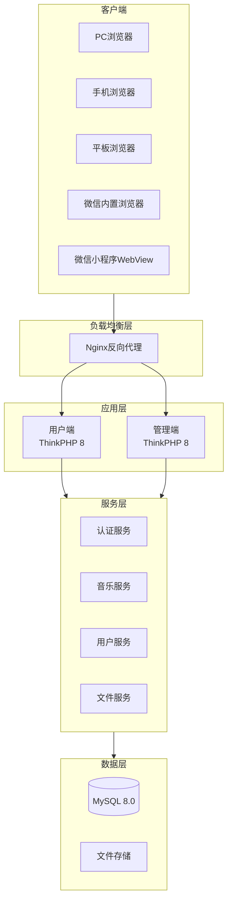
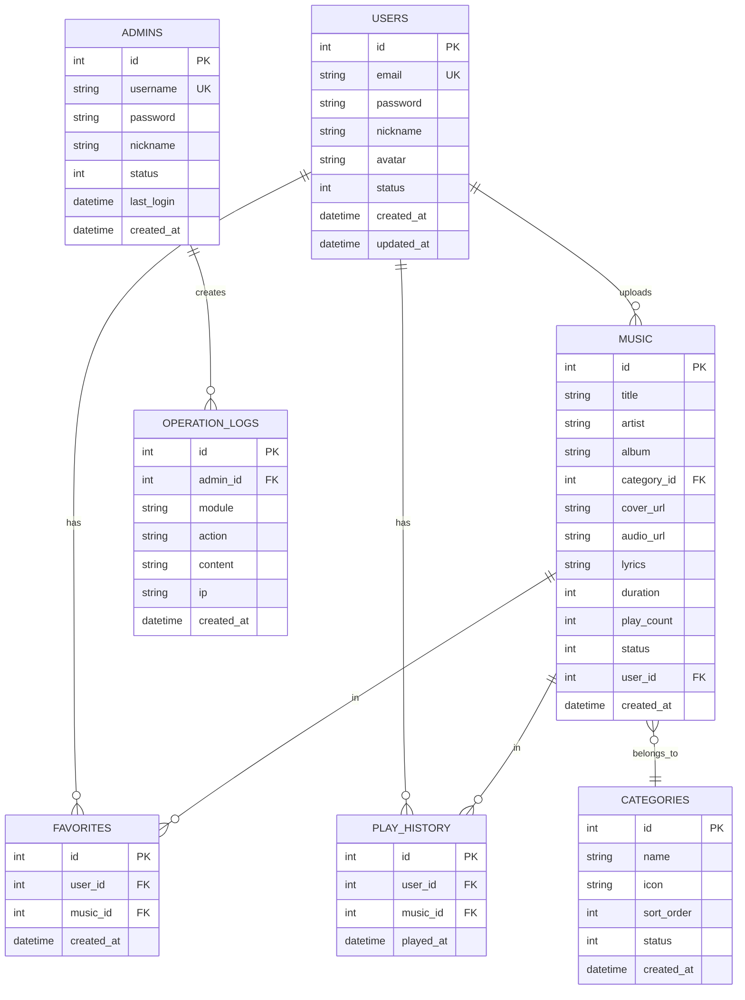

# 音乐发行平台 - 项目设计文档

## 系统架构



## ER 图



## 接口清单

### 用户端 API (UserController)

| 方法 | 路径 | 说明 |
|------|------|------|
| POST | /api/auth/register | 用户注册 |
| POST | /api/auth/login | 用户登录 |
| GET | /api/user/profile | 获取用户信息 |
| PUT | /api/user/profile | 更新用户信息 |

### 音乐 API (MusicController)

| 方法 | 路径 | 说明 |
|------|------|------|
| GET | /api/music/list | 音乐列表 |
| GET | /api/music/detail/:id | 音乐详情 |
| GET | /api/music/search | 搜索音乐 |
| GET | /api/music/recommend | 推荐音乐 |
| GET | /api/music/ranking | 排行榜 |
| POST | /api/music/play/:id | 记录播放 |

### 收藏 API (FavoriteController)

| 方法 | 路径 | 说明 |
|------|------|------|
| GET | /api/favorite/list | 收藏列表 |
| POST | /api/favorite/add | 添加收藏 |
| DELETE | /api/favorite/remove/:id | 取消收藏 |

### 管理端 API

#### 认证 (AdminAuthController)

| 方法 | 路径 | 说明 |
|------|------|------|
| POST | /api/admin/login | 管理员登录 |
| POST | /api/admin/logout | 退出登录 |

#### 音乐管理 (AdminMusicController)

| 方法 | 路径 | 说明 |
|------|------|------|
| GET | /api/admin/music/list | 音乐列表 |
| POST | /api/admin/music/create | 创建音乐 |
| PUT | /api/admin/music/update/:id | 更新音乐 |
| DELETE | /api/admin/music/delete/:id | 删除音乐 |

#### 用户管理 (AdminUserController)

| 方法 | 路径 | 说明 |
|------|------|------|
| GET | /api/admin/user/list | 用户列表 |
| PUT | /api/admin/user/status/:id | 更新状态 |

#### 分类管理 (AdminCategoryController)

| 方法 | 路径 | 说明 |
|------|------|------|
| GET | /api/admin/category/list | 分类列表 |
| POST | /api/admin/category/create | 创建分类 |
| PUT | /api/admin/category/update/:id | 更新分类 |
| DELETE | /api/admin/category/delete/:id | 删除分类 |

## UI/UX 规范

### 色彩系统

```css
:root {
    /* 主色调 */
    --primary-color: #6366f1;
    --primary-light: #818cf8;
    --primary-dark: #4f46e5;
    
    /* 辅助色 */
    --success-color: #10b981;
    --warning-color: #f59e0b;
    --danger-color: #ef4444;
    --info-color: #3b82f6;
    
    /* 中性色 */
    --text-primary: #1f2937;
    --text-secondary: #6b7280;
    --text-muted: #9ca3af;
    --border-color: #e5e7eb;
    --bg-primary: #ffffff;
    --bg-secondary: #f9fafb;
    --bg-tertiary: #f3f4f6;
}
```

### 字体规范

- 主字体: -apple-system, BlinkMacSystemFont, "Segoe UI", Roboto, "PingFang SC", "Microsoft YaHei"
- 标题字号: 24px / 20px / 18px / 16px
- 正文字号: 14px
- 辅助字号: 12px
- 行高: 1.5

### 间距系统

- xs: 4px
- sm: 8px
- md: 16px
- lg: 24px
- xl: 32px

### 圆角规范

- 小圆角: 4px (按钮、输入框)
- 中圆角: 8px (卡片)
- 大圆角: 12px (弹窗、大卡片)
- 圆形: 50% (头像)

### 阴影规范

```css
--shadow-sm: 0 1px 2px rgba(0, 0, 0, 0.05);
--shadow-md: 0 4px 6px rgba(0, 0, 0, 0.1);
--shadow-lg: 0 10px 15px rgba(0, 0, 0, 0.1);
```

### 响应式断点

```css
/* 手机 */
@media (max-width: 767px) { }

/* 平板 */
@media (min-width: 768px) and (max-width: 1023px) { }

/* 桌面 */
@media (min-width: 1024px) { }

/* 大屏 */
@media (min-width: 1280px) { }
```
